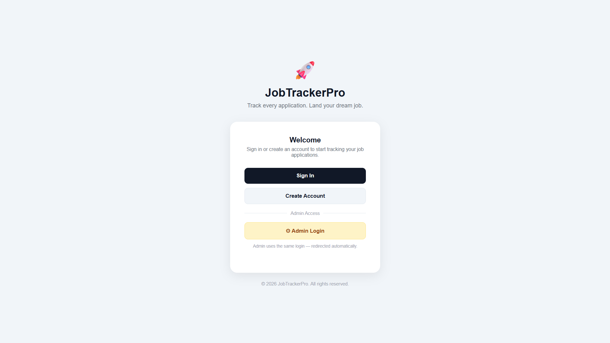
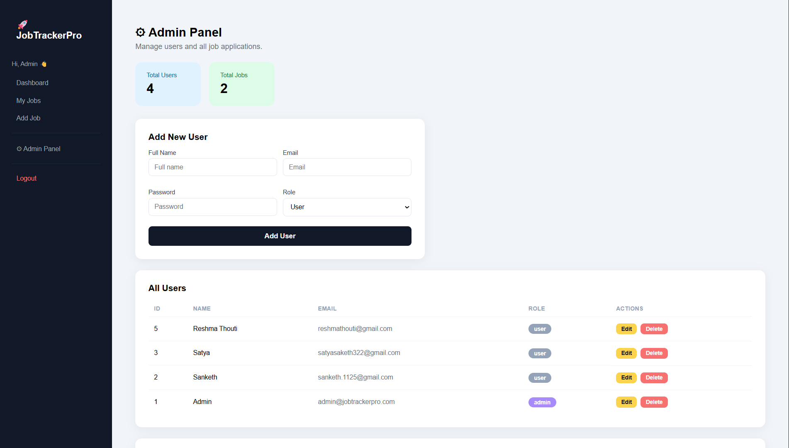
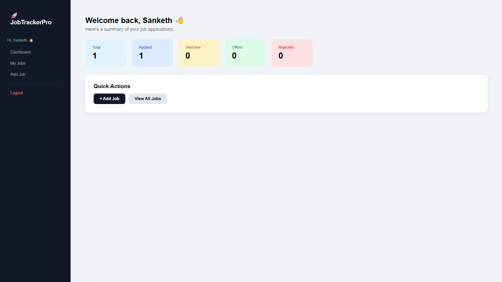
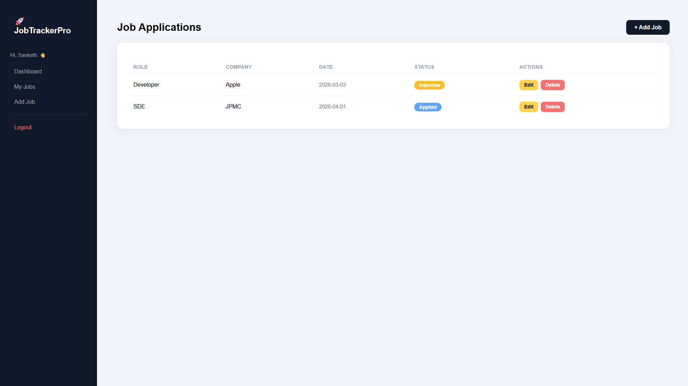
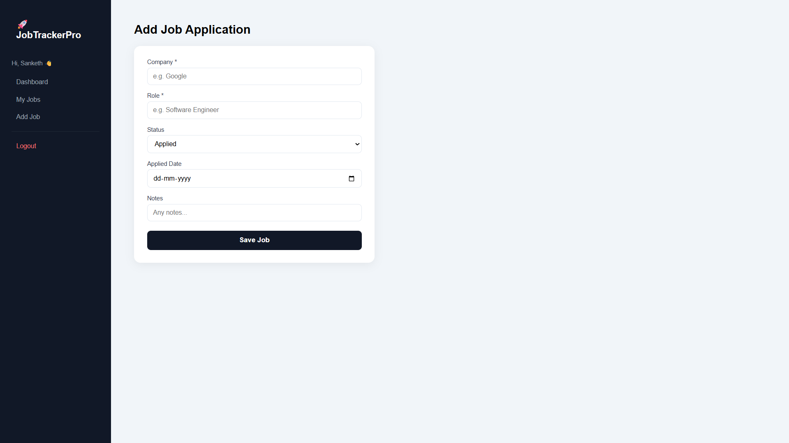

# 🚀 JobTrackerPro

A modern full-stack **Job Application Tracker** built using **Java Servlets, MySQL, and HTML/CSS**.

Track, manage, and monitor your job applications with a clean dashboard, user authentication, admin panel, and a professional UI.

---

## ✨ Features

* 🔐 **User Authentication**

  * Register & Login system
  * Session-based authentication
  * Role-based access (User / Admin)

* 📊 **Dashboard Overview**

  * Total, Applied, Interview, Offer, Rejected counts
  * Personalized per logged-in user

* ➕ **Add Job Applications**

  * Company, Role, Status, Notes, Applied Date

* 📄 **View Jobs**

  * Clean, modern table UI
  * Color-coded status badges
  * Users see only their own jobs

* ✏️ **Edit & ❌ Delete Jobs**

  * Update or remove entries anytime
  * Owners and admins only

* ⚙️ **Admin Panel**

  * View all users and all jobs
  * Add, edit, delete any user
  * Manage every job application

* 🎨 **Modern UI**

  * Dark sidebar navigation
  * Color-coded status badges
  * Clean card-based layout

---

## 🛠️ Tech Stack

| Layer        | Technology         |
| ------------ | ------------------ |
| Backend      | Java Servlets      |
| Server       | Apache Tomcat 11   |
| Database     | MySQL 8.0          |
| Frontend     | HTML, CSS          |
| Connectivity | JDBC               |
| IDE          | Eclipse IDE        |

---

## 📂 Project Structure

```
JobTrackerPro/
│
├── src/main/java/
│   ├── controller/
│   │   ├── LoginServlet.java
│   │   ├── RegisterServlet.java
│   │   ├── LogoutServlet.java
│   │   ├── DashboardServlet.java
│   │   ├── ViewJobsServlet.java
│   │   ├── AddJobServlet.java
│   │   ├── EditJobServlet.java
│   │   ├── UpdateJobServlet.java
│   │   ├── DeleteJobServlet.java
│   │   ├── AdminServlet.java
│   │   └── AdminActionServlet.java
│   │
│   ├── dao/
│   │   ├── JobDAO.java
│   │   └── UserDAO.java
│   │
│   ├── model/
│   │   ├── Job.java
│   │   └── User.java
│   │
│   └── util/
│       ├── DBConnection.java
│       └── Auth.java
│
├── src/main/webapp/
│   ├── css/
│   │   └── app.css
│   ├── index.html
│   ├── login.html
│   ├── register.html
│   └── WEB-INF/
│       ├── web.xml
│       └── lib/
│           └── mysql-connector-j-9.6.0.jar
│
├── setup.sql
└── README.md
```

---

## ⚙️ Setup Instructions

### 1️⃣ Clone the Repository

```bash
git clone https://github.com/Sanzzz1125/JobTrackerPro.git
cd JobTrackerPro
```

---

### 2️⃣ Setup MySQL Database

Open **MySQL Command Line Client** and run:

```sql
CREATE DATABASE IF NOT EXISTS job_db;
USE job_db;

CREATE TABLE IF NOT EXISTS users (
    id         INT AUTO_INCREMENT PRIMARY KEY,
    username   VARCHAR(100) NOT NULL,
    email      VARCHAR(255) NOT NULL UNIQUE,
    password   VARCHAR(255) NOT NULL,
    role       VARCHAR(20)  NOT NULL DEFAULT 'user',
    created_at DATETIME DEFAULT CURRENT_TIMESTAMP
);

CREATE TABLE IF NOT EXISTS jobs (
    id           INT AUTO_INCREMENT PRIMARY KEY,
    user_id      INT          NOT NULL,
    company      VARCHAR(255) NOT NULL,
    role         VARCHAR(255) NOT NULL,
    status       VARCHAR(50)  NOT NULL DEFAULT 'Applied',
    notes        TEXT,
    applied_date DATE,
    created_at   DATETIME DEFAULT CURRENT_TIMESTAMP,
    FOREIGN KEY (user_id) REFERENCES users(id) ON DELETE CASCADE
);

-- Default admin account
INSERT IGNORE INTO users (username, email, password, role)
VALUES ('Admin', 'admin@jobtrackerpro.com', 'admin123', 'admin');
```

> ✅ This creates the database, both tables, and a default admin account.

---

### 3️⃣ Configure Database Connection

Open `src/main/java/util/DBConnection.java` and update your credentials:

```java
private static final String URL      = "jdbc:mysql://localhost:3306/job_tracker";
private static final String USER     = "root";
private static final String PASSWORD = "your_password";
```

---

### 4️⃣ Add MySQL Connector

The connector is already included at:

```
src/main/webapp/WEB-INF/lib/mysql-connector-j-9.6.0.jar
```

If needed, download from: https://dev.mysql.com/downloads/connector/j/

---

### 5️⃣ Import into Eclipse

1. Open Eclipse → **File → Import → General → Existing Projects into Workspace**
2. Browse to the cloned/unzipped `JobTrackerPro` folder → **Finish**
3. Right-click project → **Properties → Java Compiler** → set to **Java 17**
4. Right-click project → **Properties → Targeted Runtimes** → tick **Apache Tomcat v11.0**
5. Right-click project → **Run As → Run on Server**

---

### 6️⃣ Open in Browser

```
http://localhost:8080/JobTrackerPro/
```

---

## 🔑 Default Admin Login

| Field    | Value                        |
| -------- | ---------------------------- |
| Email    | admin@jobtrackerpro.com      |
| Password | admin123                     |

> ⚠️ Change the admin password after first login via the Admin Panel.

---

## 🎯 Application Flow

```
Landing Page → Login / Register → Dashboard → View Jobs → Add / Edit / Delete
                    ↓
               Admin Login → Admin Panel → Manage Users & All Jobs
```

---

## 📸 Screenshots

### 🏠 Landing Page


### 📊 Admin Dashboard


### 📊 User Dashboard


### 📄 Jobs Page


### ➕ Add Job


---

## 🔐 Role-Based Access

| Feature              | User | Admin |
| -------------------- | ---- | ----- |
| View own jobs        | ✅   | ✅    |
| Add / Edit / Delete  | ✅   | ✅    |
| View all users' jobs | ❌   | ✅    |
| Manage users         | ❌   | ✅    |
| Access Admin Panel   | ❌   | ✅    |

---

## 🚀 Future Improvements

* 🔍 Search & filter jobs
* 📊 Charts & analytics
* 🌙 Dark mode toggle
* 📱 Mobile responsiveness
* 🔒 Password hashing (BCrypt)
* 📧 Email notifications

---

## 🧠 Learning Outcomes

This project demonstrates:

* Full-stack development using Java Servlets
* MVC architecture
* JDBC & MySQL database integration
* Session-based user authentication
* Role-based access control (RBAC)
* UI/UX design fundamentals
* Complete CRUD operations

---

## 👨‍💻 Author

**Sanketh Thatikonda**
GitHub: https://github.com/Sanzzz1125

---

## ⭐ Support

If you found this project useful:

⭐ Star this repository
🍴 Fork it
📢 Share it

---

## 🚀 Final Note

This project was built to simulate a **real-world job tracking system** with a focus on both **functionality and user experience** — featuring full authentication, role-based access, and a clean modern UI.
